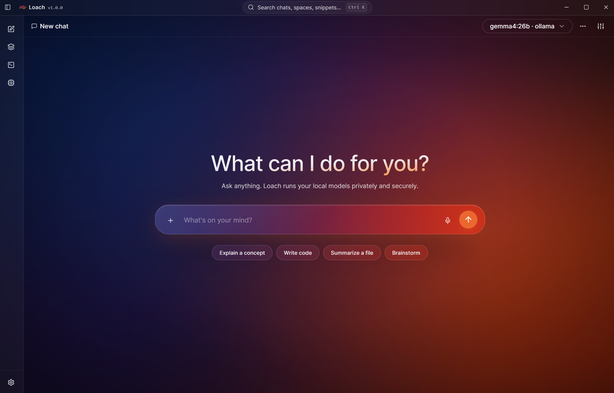

<div align="center">

# Loach

**A native, local-first AI workspace for desktops**

Run local LLMs with [Ollama](https://ollama.com) or connect any OpenAI-compatible API endpoint side-by-side, with a focused UX, local-first design, native apps for Windows and Linux, and simple yet powerful features out of the box.

[](LICENSE)

[](https://github.com/ztcs-software/loach/releases)
[](https://github.com/ztcs-software/loach/actions/workflows/release.yml)


</div>

---

## 🔭 Overview

Loach is an all-in-one desktop AI workspace built around a single idea: talking to an LLM should feel effortless. Simple from the first click and ready to grow with you as your needs do. It talks to a local Ollama server and accepts any OpenAI-compatible endpoint as a provider, including llama.cpp, LM Studio, vLLM and LiteLLM.

With local models, including Qwen, Gemma, DeepSeek, GPT-OSS and Mistral, all your data stays safe and private. There is no telemetry, no required network access, no paid subscriptions or usage limits. Optional API keys live in your OS credential manager. 

Behind a calm, beautifully crafted UI sits a rich feature set - ready when you need it, out of the way when you don't. 



---

## ✨ Features

- **Provider selection** - switch between Ollama local models and any OpenAI-compatible endpoint (OpenAI API, llama.cpp, LM Studio etc.) from the chat header.
- **Local model management** - pull, copy, customize and delete local models from inside the app. 
- **Spaces** - group chats around a project, with shared instructions, reference files and memory. 
- **Snippets** - save reusable prompts with an optional pinned model and click `Run` to start a fresh chat pre-filled and ready to send.
- **Voice dictation** - mic button in the composer turns speech into text in real time. 
- **Generation stats** - inline `tok/s · total tokens · elapsed` under every model turn.
- **Markdown rendering** - full GitHub-flavoured Markdown with tables, task lists and LaTeX support.
- **Code blocks** - syntax-highlighted with line numbers, copy, export and open in canvas options.
- **Code canvas** - open any code block in a wider, theme-aware view. 
- **Per-chat parameters** - set temperature, top_k, top_p, min_p, max tokens, context length, per-chat system prompts and more. Layered over Modelfile and per-model defaults.
- **Personas and Tones** - pick a role (Code Reviewer, Translator, ELI5...) and delivery style (Formal, Casual, Concise, Detailed...).
- **Custom instructions** - set your custom instructions for models globally, per-chat or per-Space. 
- **Import and export context** - export chat context to JSON or Markdown and paste exported data - or any text - back to any chat's context.
- **Search** - search across chats, spaces and snippets, plus a browser-style in-chat finder with phrase highlighting.
- **Chat archive** - move chats out of the sidebar without deleting them; restore or delete them from dedicated archive view.
- **MCP support** - register Model Context Protocol servers (Streamable HTTP), test the handshake and inspect the tools they provide. 
- **Web fetch** - add URLs to messages and they will be fetched, sanitized and inlined to context. 
- **Temporal awareness** - inject current date, time, weekday and timezone into the system prompt so models can answer to "what day is it today?".
- **Default model selector** - pick a model new chats open with, per provider - no need to re-select on each fresh conversation.
- **Model preloading** - optionally warm your default local model into VRAM at launch so the first message streams faster. 
- **Low VRAM mode** - global or per-chat toggle that sends Ollama's `low_vram` flag to every request. Useful on lower-spec devices. 
- **Data management** - make backups of your content to JSON file, restore data or permanently delete it with a few clicks. 
- **App lock** - optional PIN, password or PIN + password gate at launch; credentials are hashed and stored in OS credential manager.
- **Themes** - glassy, gradient Aurora or flat Solid, both available in Dark and Light variants.
- **OTA updates** - get new features, bug fixes, performance improvements and security patches directly from the app. 

...and more! 

We are working on extending the list above, including new RAG and agentic features. 

---

## 💾 Install Loach


Loach can be installed from a pre-built package (currently available for Windows and Linux) or built from source. 

### Install from a pre-built package

With each stable release we publish pre-built `.exe`, `.deb`, `.rpm` or `.AppImage` packages ready to be downloaded and installed according to your operating system.

[](https://github.com/ztcs-software/loach/releases)

**👉 Download a pre-built package from the [latest stable release](https://github.com/ztcs-software/loach/releases/latest)**

> [!NOTE]
>For local models make sure [Ollama](https://ollama.com) is up and running (`ollama serve`). If you don't have any models pulled yet, Loach will offer to install one during onboarding. 

### Build from source

#### Prerequisites

- **Node.js 20.19+** (or 22.12+) and **npm** — Vite 7 won't run on older 20.x point releases.
- **Rust** stable toolchain via [`rustup`](https://rustup.rs)
- Platform build tooling — install once via the official Tauri prerequisites guide: <https://tauri.app/start/prerequisites/>
  - **Windows**: Microsoft Visual Studio Build Tools, WebView2 runtime (preinstalled on Windows 11)
  - **Linux**: `webkit2gtk-4.1`, `libayatana-appindicator3-dev`, `librsvg2-dev`, `build-essential`, `libssl-dev`, `pkg-config`, `libsecret-1-dev`

#### Clone and install

```bash
git clone https://github.com/ztcs-software/loach.git
cd loach
npm install
```

#### Run in development

```bash
npm run tauri dev
```

The Vite dev server runs on `http://localhost:1420` and the Tauri shell embeds it. 

#### Build production installers

```bash
npm run tauri build
```

Outputs land in `src-tauri/target/release/bundle/`:

- **Windows**: `.exe` (NSIS)
- **Linux**: `.deb`, `.rpm` and `.AppImage`

---

## 🚀 Getting started

Loach doesn't provide built-in models, therefore it requires a provider choice - Ollama or OpenAI-compatible endpoint (OpenAI API, llama.cpp, LM Studio etc.)

### Using with Ollama

```bash
ollama serve
ollama pull gemma4:e4b      # or any other tag
```

Loach probes `http://localhost:11434` on launch. Pulled models appear in the chat header dropdown automatically; the **Models** library tab also lets you pull new tags and customise existing ones from inside the app.

### Using with OpenAI-compatible endpoints

Open **Settings → Providers**, paste your API key (stored safely in your OS credential manager), and point the base URL to any compatible endpoint:

| Provider | Base URL |
|---|---|
| OpenAI | `https://api.openai.com/v1` *(default)* |
| vLLM | `http://localhost:8000/v1` |
| LM Studio | `http://localhost:1234/v1` |
| LiteLLM | `http://localhost:4000/v1` |
| llama.cpp `llama-server` | `http://localhost:8080/v1` |
| Groq, OpenRouter, Together, Fireworks, Mistral | per their docs |

Only one OpenAI-compatible endpoint is active at a time — switch the base URL in Settings whenever you want to point to a different provider.

---

## 🛠️ Tech stack

| Layer | Choice |
|---|---|
| Desktop shell | Tauri 2.x (Rust) |
| Frontend | React 18 + Vite 7 + TypeScript |
| Styling | Tailwind CSS + shadcn/ui (Radix primitives) + `tailwindcss-animate` + `@tailwindcss/typography` |
| Icons | `lucide-react` |
| State | Zustand (in-memory; backed by SQLite for persistence where appropriate) |
| Storage | SQLite via `rusqlite` (bundled feature — no system dependency) |
| Secrets | `keyring` crate → Windows Credential Manager / Linux Secret Service |
| Argon2id | `argon2` + `rand_core` (for app-lock hashing) |
| HTTP | `reqwest` with streaming + `rustls-tls` |
| Markdown | `react-markdown` + `remark-gfm` + `rehype-highlight` (highlight.js) |
| Document parsing | `pdfjs-dist` (PDF) + `mammoth` (DOCX) |
| System tray | Tauri 2 built-in (`tray-icon` feature) |
| Bundle targets | `.exe` (NSIS) on Windows; `.deb` / `.rpm` / `.AppImage` on Linux |

---

## 🔒 Storage and privacy

| What | Where |
|---|---|
| Chats, messages, spaces, snippets, MCP servers, app settings | SQLite at `<app-data-dir>/loach.db` |
| OpenAI API key | OS credential manager (Windows Credential Manager / Linux Secret Service) |
| App-lock hash + hint | OS credential manager — same store, separate entry |
| Attached files (images, text) | Inlined into the message at send time; no separate file store |
| App data dir on Windows | `%APPDATA%\dev.loach.app\` |
| App data dir on Linux | `~/.local/share/dev.loach.app/` |

Loach launches and works completely offline as long as you stick to local providers. The **Models** library, **Spaces**, **Snippets**, search, parameter sidebar, app lock, and chat history are all available without network access. Only chat generations against remote endpoints (OpenAI, Groq, OpenRouter, …) require internet connection.

---

## 📜 License

[MIT](LICENSE) © ZTCS
